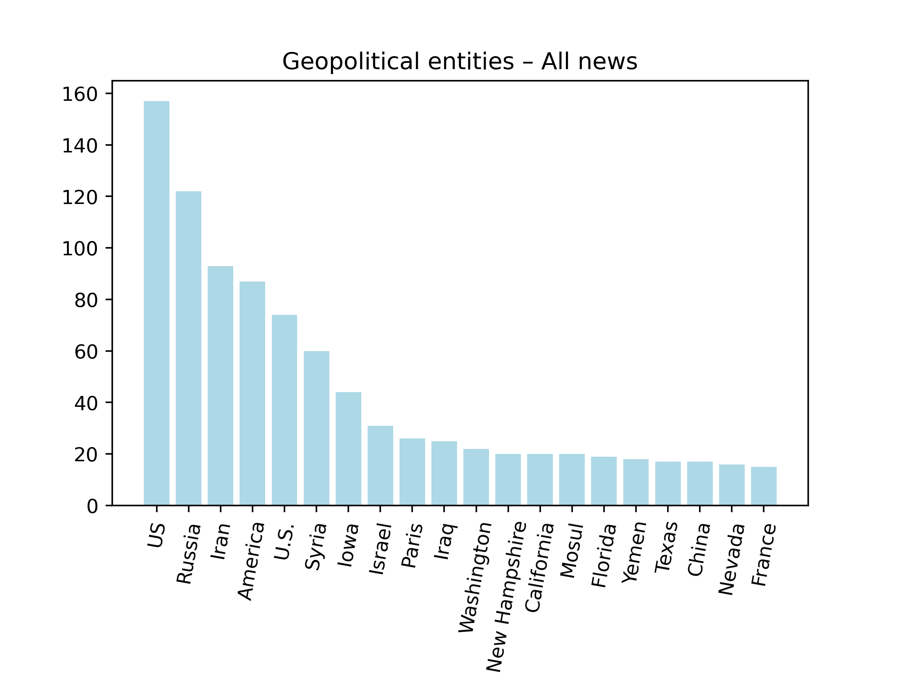
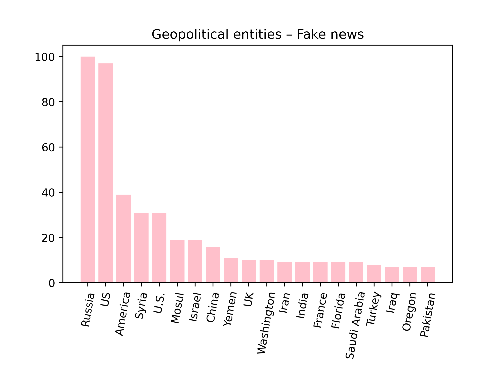
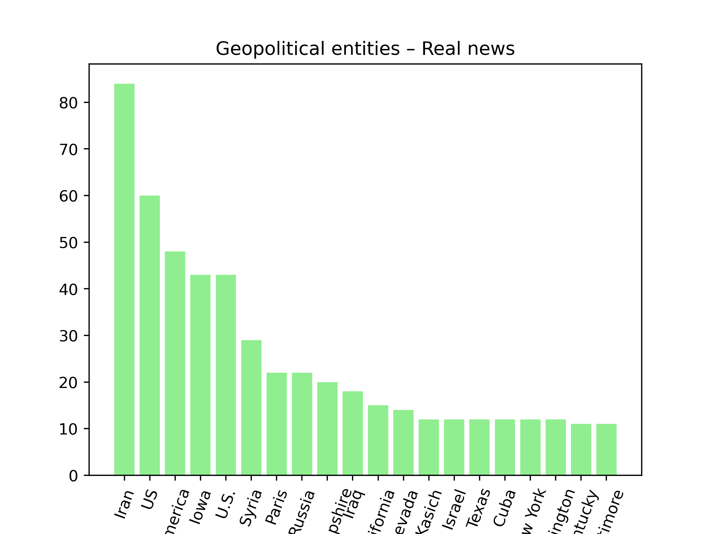

# Assignment 2 - Sentiment and NER
The portfolio for __Language Analytics S22__ consists of 5 projects (4 class assignments and 1 self-assigned project). This is the __second assignment__ in the portfolio. 

## 1. Contribution
The initial assignment was made partly in collaboration with others from the course, but the final code is my own. I made several adjustments to the code since I first handed it in. I used [this blog post](https://www.geeksforgeeks.org/python-sentiment-analysis-using-vader/) to find the threshold for qualitatively evaluate `VADER` scores as either positive, negative, or neutral.

## 2. Assignment description by Ross
### Main task
For this assignment, you will write a small Python program to perform NER and sentiment analysis using the techniques you saw in class. You have the choice of one of two different tasks:

1. Using the corpus of English novels, write some code which does the following tasks

   - For every novel in the corpus
     - ~~Get the sentiment of the first sentence.~~
     - Get the sentiment of the final sentence.
     - Plot the results over time, with one visualisation showing sentiment of opening sentences over time and one of closing sentences over time.
     - Find the 20 most common geopolitical entities mentioned across the whole corpus - plot the result as a bar chart.

**OR**

2. Using the corpus of Fake vs Real news, write some code which does the following

   - Split the data into __two datasets__ - one of Fake news and one of Real news
   - For every headline:
     - Get the sentiment scores,
     - Find all mentions of geopolitical entites,
     - Save a CSV which shows the text ID, the sentiment scores, and column showing all GPEs in that text.
   - Find the __20 most common geopolitical entities__ mentioned across each dataset - plot the results as a __bar charts__.

### Bonus task
- For the novels, you can try to do the first sentence, too - but this is tricky!
- You're welcome to do both tasks, if you want! But this is not required at all.
- Repeat experiments using both sentiment analysis techniques, in order to compare results.

## 3. Methods
I decided to go with the __second task__, i.e. working with the Fake vs Real news dataset.

### Main task
The [`NER_sentiment.py`](https://github.com/agnesbn/LANG_assignment2/blob/main/src/NER_sentiment.py) script reads the data CSV and after some processing and cleaning of the CSV, it splits it into two dataframes, one for fake news and one for real news. It then calculates __`VADER` sentiment scores__ for each text in both dataframes. Furthermore, a qualitative evaluation of the sentiment scores is added to the dataframe. Here, the sentiment of a text is deemed, __negative__ if the `VADER` compound score is under -0.5, __neutral__ if it is between -0.5 and 0.5, and __positive__ if it is higher than 0.5. Then the geopolitical entities are extracted by running the texts through an NLP pipeline. Finally, the results are saved as CSVs - one for real news and one for fake news - and the geopolitical entities in the texts are counted and the results are saved as barplots – one for the fake news, one for the real news, and one for entities in both texts.

### Bonus task
I was not able to complete any of the bonus tasks for this assignment.

## 4. Usage
### Install packages
Before running the script, you have to install the relevant packages. To do this, run the following from the command line:
```
sudo apt update
pip install --upgrade pip
pip install pandas numpy spacy vaderSentiment
python -m spacy download en_core_web_sm
```

### Get the data
- The data should be provided to the examiner by Ross.
- Place the data CSV in the `in` folder so that the path to the data is `in/fake_or_real_news.csv`.

### Main task
Make sure your current directory is the `LANG_assignment2` folder. Then from the command line, run:
```
python src/NER_sentiment.py
```

The result CSVs are saved in [`out/tables`](https://github.com/agnesbn/LANG_assignment2/tree/main/out/tables) and the result plots are saved in [`out/plots`](https://github.com/agnesbn/LANG_assignment2/tree/main/out/plots).

## 5. Discussion of results

**All news**                             |
:---------------------------------------:|
          |


As you can tell from the output plots for respectively the fake and the real news, `US` (and variations of this) is mentioned a lot in both the real and the fake news. However, where there is a more even distribution of geopolitical entities in the real news, `US` and `Russia` scores a lot higher than other entities in the fake news dataset. Furthermore, `Iran` scores high in the real news data but not at all in the fake news data.
**Fake news**                            |  **Real news**
:---------------------------------------:|:---------------------------------------:
         |  

As you can tell, the GPEs were not registrered perfectly and this has skewed the bar plots. For instance, `US`, `U.S.` and `America` were registrered as three different entities. I tried replacing every instance of `U.S.` with `US` in the dataset but this did not change the results.
