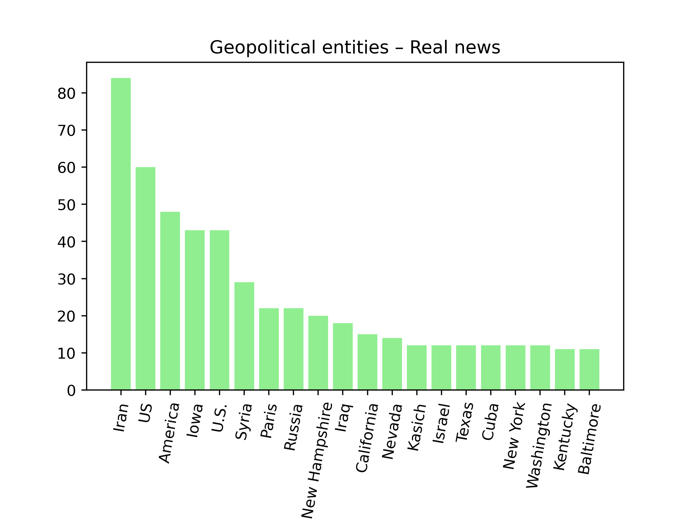

# Assignment 2 - Sentiment and NER
The portfolio for __Language Analytics S22__ consists of 5 projects (4 class assignments and 1 self-assigned project). This is the __second assignment__ in the portfolio. 

## 1. Contribution
The initial assignment was made partly in collaboration with others from the course, but the final code is my own. I made several adjustments to the code since I first handed it in.

https://www.geeksforgeeks.org/python-sentiment-analysis-using-vader/ How to see whether something is negative, positive or neutral.

## 2. Assignment description by Ross
### Main task
For this assignment, you will write a small Python program to perform NER and sentiment analysis using the techniques you saw in class. You have the choice of one of two different tasks:

1. Using the corpus of English novels, write some code which does the following tasks

   - For every novel in the corpus
     - ~~Get the sentiment of the first sentence.~~
     - Get the sentiment of the final sentence.
     - Plot the results over time, with one visualisation showing sentiment of opening sentences over time and one of closing sentences over time.
     - Find the 20 most common geopolitical entities mentioned across the whole corpus - plot the result as a bar chart.

**OR**

2. Using the corpus of Fake vs Real news, write some code which does the following

   - Split the data into two datasets - one of Fake news and one of Real news
   - For every headline
     - Get the sentiment scores
     - Find all mentions of geopolitical entites
     - Save a CSV which shows the text ID, the sentiment scores, and column showing all GPEs in that text
   - Find the 20 most common geopolitical entities mentioned across each dataset - plot the results as a bar charts

### Bonus task
- For the novels, you can try to do the first sentence, too - but this is tricky!
- You're welcome to do both tasks, if you want! But this is not required at all.
- Repeat experiments using both sentiment analysis techniques, in order to compare results.

## 3. Methods
I decided to go with the second task, i.e. working with the Fake vs Real news dataset.
### Main task


### Bonus task


## 4. Usage
### Install packages
Before running the script, you have to install the relevant packages. To do this, run the following from the command line:
```
sudo apt update
pip install --upgrade pip
# required packages
pip install pandas numpy spacy vaderSentiment
# install spacy model
python -m spacy download en_core_web_sm
```

### Get the data
The data should be provided to the examiner by Ross.

### Main task


### Bonus task


## 5. Discussion of results


**Fake news**                            |  **Real news**
:---------------------------------------:|:---------------------------------------:
         |  
